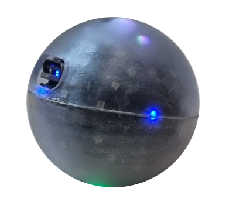
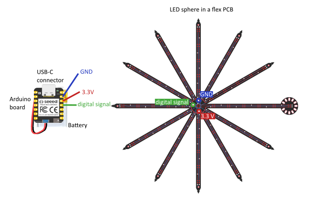

<script>
  import Callout from '$lib/components/Callout/Callout.svelte'
</script>

## What is the Qbead

The Qbead is a simulator that lets you interact with a qubit with your hands.

The light in the Qbead represents the quantum state of a qubit. 
Think of the light spot in the Qbead as the tip of the state vector in a Bloch sphere.
You do not know what this means yet? No worries, we got you covered! Check out our qubit lesson FIXME @Stefan link here


FIXME @Stefan can we add here a side by side comparison of the Qbead (just the picture above) and the bloch sphere widget?

But with the Qbead we do not only see quantum states: we change them!
- By rotating your Qbead in any direction you perform qubit gates! This means, the vector of the qubit rotates around the Bloch sphere.
- By gently tapping the Qbead you perform a quantum measurement, with its axis along the tapping direction!

FIXME @Stefan maybe some widget or videos of qubit rotations and measurements would be good!

 With these tools, we can now do a lot of fun quantum experiments while learning very important concepts in quantum physics and engineering.

Features:
- All operations done via movement: rotate it! shake it! tap it!
- Fully programmable through USB and bluetooth
- Website-guided interactive lecture materials
- Open source (and cheap!) hardware and software - soon you will be able to request yours!


### Inside the Qbead: hardware

- The brains: Seeed XIAO nRF52840 Sense, containing
  - Microprocessor to run the code
  - USB port for charging, loading code, and reading variables
  - Bluetooth for wireless communication
  - Inertial measurement unit to read out the Qbead movements
- The power: Lithium polymer battery CLY502020 3.7V +140mAh 0.52Wh
- The color: custom-made LED flexPCB
  - Flex PCB
  - 62 smart LEDs in series
- The frame: custom-made 3D printed shells
  - Inner shell holding the board and battery
  - Outer transparent shell protecting the Qbead

<div class="flex flex-col items-center">



</div>

<div class="flex flex-col items-center">


</div>

### Inside the Qbead: software

- Firmware Qbead.h that lays out the library of functions 
- Sketches for each experiment that use several functions and put them into loops
FIXME @Stefan links to Qbead.h and example lessons?

## Limitations of our Qbead vs. an ideal qubit 

Our Qbead is of course not exactly a qubit (otherwise it wouldn't so hard to build those!). Some of the important differences are:
- This is an electronic gadget, and so all the quantum mechanical effects are simulated - coded into our scripts
- Observing states without measuring - in real qubits, observing a state means measuring it. In the Qbead we chose to let you see the state and choose when to measure it because we think this has more educational value (ok, it also looks cooler!)
- Discreteness - we only have a set number of LEDs, while qubit states can rotate continuously in the Bloch sphere
- Representing mixed-state density matrices - 
- Accuracy of visualization - an ideal qubit state is a vector pointing to an infinitely small point in the sphere, while our LEDs are larger than infinitely small points
- Accuracy of gates when done via analog gestures - hand gestures are of course not as accurate as the pulse gates used to rotate qubits. For the Qbead, we choose to options depending on the educational goal of the experiment: 1) let the error be to showcase the real problems with errors in qubits, or 2) lock gates in software so that your gates are always perfect.


<Callout title="Lesson Note">

Here is a callout box that can be used throughout a lesson to highlight an important point, note, or something students generally will need to draw attention to or remember.

</Callout>

<Callout>

Here is a plain one without a title

</Callout>

<Callout type="alert">

Here is a warning

</Callout>

## You can also add math

<Callout type="question">

Solve for $x$ given,

$
x^2 + x - 2 = 0
$

</Callout>

To solve for $x$ we can apply the *quadratic formula*.

$$
x = \frac{-b \pm \sqrt{b^2 - 4ac}}{2a},
$$

where,

$$
\begin{aligned}
a &= 1 \\
b &= 1 \\
c &= -2
\end{aligned}
$$

Substituting the values we get:

$$
\begin{aligned}
x &= \frac{-1 \pm \sqrt{1^2 - 4(1)(-2)}}{2(1)} \\
&= \frac{-1 \pm \sqrt{1^2 + 8}}{2} \\
&= -0.5 \pm 3/2 \\
&= -2, 1
\end{aligned}
$$

## You could even add some code

```py
def say_hello():
  print("Oh. Hi there.")
```


<div class="grid grid-cols-2 items-start gap-6">

<div>

A side-by-side may be useful when referring to code blocks or outlining/describing sections of code, though these can be formatted in any way you'd like.

However, this won't _collapse_ on mobile.

</div>

```html
<!-- Create a side-by-side layout -->
<div class="grid grid-cols-2 items-start gap-6">

<div>

Left Side.

</div>

<div>

Right Side.

</div>

</div>
```

</div>

<div class="grid grid-cols-1 md:grid-cols-2 items-start md:gap-6">

<div>

So to collapse on mobile, set the default grid cols to 1
with `grid-cols-1` then specify that on medium and up
we want 2 cols: `md: grid-cols-2`.

Do the same for the gap: `md:gap-6`.

</div>

```html
<!-- Create a side-by-side layout that collapses on mobile -->
<div class="grid grid-cols-1 md:grid-cols-2 items-start md:gap-6">

<div>

Left Side.

</div>

<div>

Right Side.

</div>

</div>
```

</div>


## Images

You can easily add an image the normal markdown way. To add a caption,
you can add a `^` to the image text like so: ``.
But to align it you'll have to wrap it in a `<div>` with appropriate
classes.

<div class="flex flex-col items-center">


</div>
