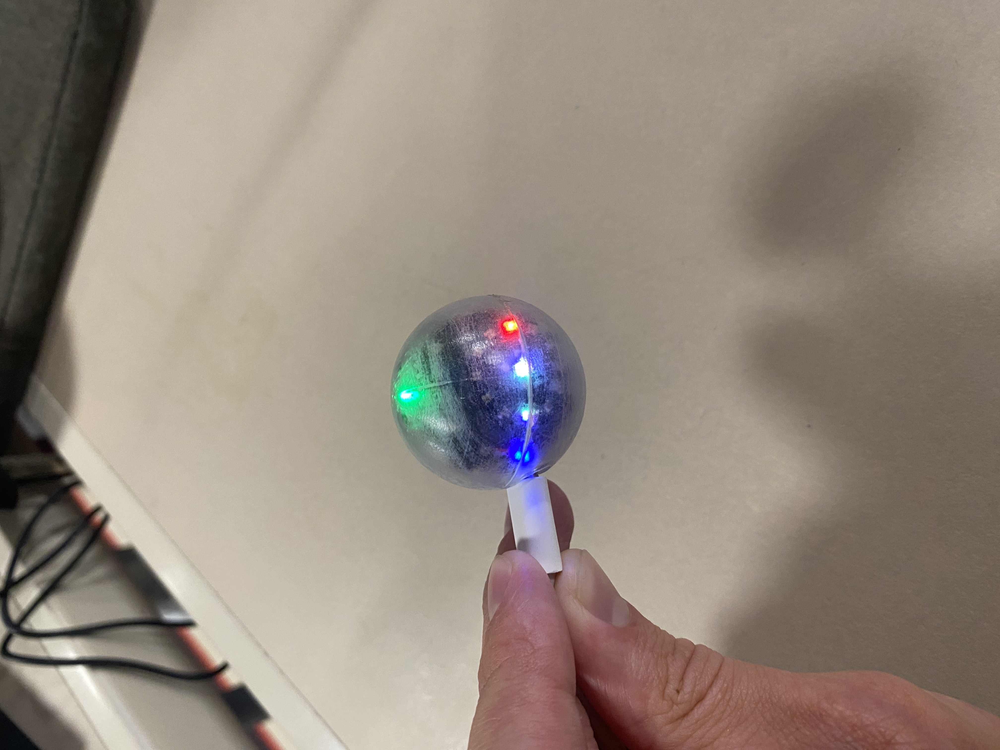

  # Introduction

Quantum decoherence is the loss of quantum coherence, where a loss of information of a system to its environment occurs due to noise. Quantum computing relies on quantum coherence. In order to suppress decoherence, a method, called Dynamic Decoupling (DD), can be applied. In this lesson you will use an electronic device, called the QBead, to study the problem of decoherence and its solution using DD.

This is the first lesson in the course. We will cover the following topics:

## Topics
- Problem : Decoherence
- Solution : Perfect Dynamical Decoupling
- Challenge : Imperfect Dynamical Decoupling

# The QBead

**(Brief description of the QBead)**

During this lesson, you will interact with the QBead, an electronic device designed to visualize and simulate a qubit, the fundamental unit of information in quantum computing.
A qubit can be thought of as a quantum particle, and the QBead allows you to explore this concept in a tangible way through a series of interactive experiments.
The device is built around an Arduino board connected to a motion sensor and a sphere made of more than 60 LED lights, all protected by a 3D-printed plastic shell with a USB port for charging and uploading content. You will provide inputs to the QBead by moving and rotating it, and you will receive outputs through the patterns displayed on the LEDs.
  
% Image of the Qbead 
  
In the image, we can see the device both with the lights off and during an experiment with the LEDs on. 

# Dynamic Decoupling for Qubit Decoherence
## Bloch Sphere

**(short description of a Bloch Sphere)**

Every quantum particle has its own intrinsic spin. The axis of this spin can be represented as a state vector on the surface of a sphere, which is called the Bloch sphere. If a constant magnetic field is applied to the quantum particle, then the quantum state vector will precess around the magnetic field. The state vectors which point in the same and opposite directions to the magnetic field are therefore stable states, which we will call the $|0\rangle$ and $|1\rangle$ state, which correspond to binary bit states.

## Spin Precession
In this lesson, we have assumed that our quantum system is placed inside an external magnetic field. When the field is not aligned with the phase of the system, it induces a torque on the system's magnetic moment that causes the system to `wobble' around the magnetic field axis. This wobbling is known as *precession*.

% Widget of precessing vector!

## Decoherence and Dynamic Decoupling

**(description of problem and solution)**

This experiment shows the precession of a quantum system, such as an array of qubits, around a (known) magnetic field axis. As time evolves, different components of the quantum ensemble begin to precess at different rates due to the interference of unknown environmental effects (noise), which causes a loss of phase coherence between the components. 

The goal of this experiment is to demonstrate Dynamical Decoupling (DD), which is a quantum control procedure that can be used to reverse the decoherence of the ensemble. DD involves applying a rapid series of control pulses that invert the phase differences that accumulate between the states.

# Experiments

This lesson is comprised of three QBead experiments, which will increase in complexity to help you understand the basic principles of Decoherence and Dynamical Decoupling. The first experiment is a basic, non-interactive demonstration of the principle of decoherence, while the following two experiments are opportunities for you to try implementing the Dynamical Decoupling procedure yourself.

## Decoherence Visualisation

% Create javascript widget animations for each experiment!

\setkeys{Gin}{width=.5\linewidth}

**(how decoherence is represented onto the QBead)**

We can model the loss of coherence on the QBead as a `spreading-out' of a known state vector (representing a coherent ensemble) into a collection of vectors representing individual states that progressively lose coherence with each other. This is exactly what the first experiment shows; the initial coherent state is represented by an (unmoving) white LED, but as time passes, the decohering states begin to appear as red LEDs that slowly spread away from the white one. Watch how quickly the coherent phase of the system spreads out into a big collection of individual states!

This is a very big problem for quantum computers, as quantum systems are only useful for computation as long as they remain coherent. However, it is very challenging to eliminate quantum noise entirely, which is why quantum control protocols such as Dynamical Decoupling are required to maintain coherence.

## Simple Dynamical Decoupling

\setkeys{Gin}{width=.5\linewidth}

**(how to use the simple version of the dynamical decoupling experiment)**

This experiment gives you the opportunity to observe phase decoherence in a system on the QBead, and to implement the Dynamical Decoupling protocol yourself!

The quantum ensemble is modeled by a white light on the QBead that immediately begins to rotate around the green point at the top. This rotating behaviour is called *precession*; see the end of this lesson if you would like to learn more. As time progresses, notice how two other lights (a blue and a red one) begin to emerge from around the white one... these represent states in our quantum system that have decohered from the system itself, due to something called quantum noise.

After some time, these points will have spread out from one another, and now the Dynamical Decoupling procedure is required to bring them back together so that the system is once again coherent. This procedure is surprisingly straightforward; all you have to do is flip the QBead upside down! 

% figure/demonstration of how to flip the QBead 

Once you have inverted the QBead, watch as the vectors begin to overlap with one another again; the blue vector is now ``behind'' the others and rushes to ``catch up'', while the red vector (now at the front) ``slows'' down. This means that the quantum noise is now ``undoing'' its previous decoherence!

In this Simple version of the experiment, the the green LED is restricted in the orientations it can be. This means that it is locked to the closest 90-degree increment of the sphere to the top, so that the green point doesn't move around too much. This is done to stabilise the rotation of the blue, white, and red points, as in reality, shaky hands can disrupt the Dynamical Decoupling procedure! This is the problem that this ``Simplified'' experiment is trying to fix; by restricting the possible orientations green point, the ``flip'' is easier to execute.

% another figure

Please note that this experiment is equipped with a reset sequence which will engage periodically. This means you don't have to worry if you make a mistake with flipping the QBead, as the reset will bring you back to the start. The sequence is shown when the green LED begins to ``blink'' for a short period and all other vectors disappear.

## Advanced Dynamical Decoupling

\setkeys{Gin}{width=.5\linewidth}

**(how to use the advanced version of the dynamical decoupling experiment)**

In this advanced version of the Dynamical Decoupling procedure, the magnetic field axis is no longer restricted to 90-degree increments, meaning the green LED always points *truly* vertical. This means that moving or rotating the QBead even a small amount can shift the blue, white, and red points out of plane with one another, making it almost impossible to successfully implement the Dynamical Decoupling procedure! This also means that when you do apply the procedure, the flip must be both (a) instantaneous and (b) perfectly 180 degrees, as otherwise the planes of precession can again become misaligned. It is difficult to get right, but the experiment is otherwise identical to the simple version. This experiment demonstrates how careful we need to be with these quantum systems in the real world, and how perfectly we need to apply quantum control protocols.

# Learn More

**(section for anyone who wants to learn more about the physics of the experiments)**

## Dynamical Decoupling

% Very much unfinished! These sections have been individually cut from above, and haven't been stitched together yet

...the loss of coherence due to quantum noise is modeled by two more vectors which represent the ``envelope" of the ensemble's states spreading out. The ``front" boundary (states precessing faster than the white point) is modeled by a blue point on the QBead, and the ``back" boundary is modeled by a red point.

The green point on the QBead represents an external magnetic field, and so the green point stays at the top of the QBead since the field is not changing. immediately begins to precess about the magnetic axis, depending on the relative orientations of the ensemble and the axis. For example, if they are parallel, the ensemble will not precess; if they are perpendicular, the ensemble will precess on the perpendicular plane; and if they are somewhere in-between parallel and perpendicular, the ensemble will precess on a different plane. 

...by 180 degrees about an axis perpendicular to the main axis of precession once the ensemble has decohered. This means that you need to invert the QBead with respect to the magnetic field axis, or in other words, flip it upside down!

If you measure the time that the three vectors have been decohering for (since the were all in-phase) to be $\tau$, then $\tau$ time after you apply the decoupling procedure you will see that the ensemble is again coherent as the three vectors overlap one another again. Now, you can let the ensemble begin to decohere for another period of $\tau$, apply the decoupling procedure again, and so forth, thus creating a periodic routine of decoherence and decoupling. The stricter the tolerance you require is (i.e., the ``amount'' of decoherence that you find to be acceptable), the more often you will need to apply the decoupling procedure (i.e., the shorter $\tau$ should be).

Your routine should look like this:

1. Begin the experiment, and watch the vectors ``spread out'' for a time $\tau$.
2. Apply the decoupling procedure at time $\tau$. At time $2\tau$, notice that the ensemble is once again coherent.
3. At time $3\tau$, apply the procedure once more.
4. Repeat!

Notice that after you let the ensemble decohere for time $\tau$, applying the dynamical decoupling procedure every $2\tau$ periods of time will maintain a (semi) coherent ensemble!

If the ensemble has decohered, each state in the system is precessing on *different* planes while the QBead is being flipped, since each of their planes are no longer aligned while their orientation relative to the magnetic field changes. Once the system has been flipped fully, then the planes of precession of every state in the ensemble are re-aligned, but in the moment of the flip they can become disaligned if the flip is not quick enough.

## Frequency Of The Pulses
How selected frequency of the pulses is decided